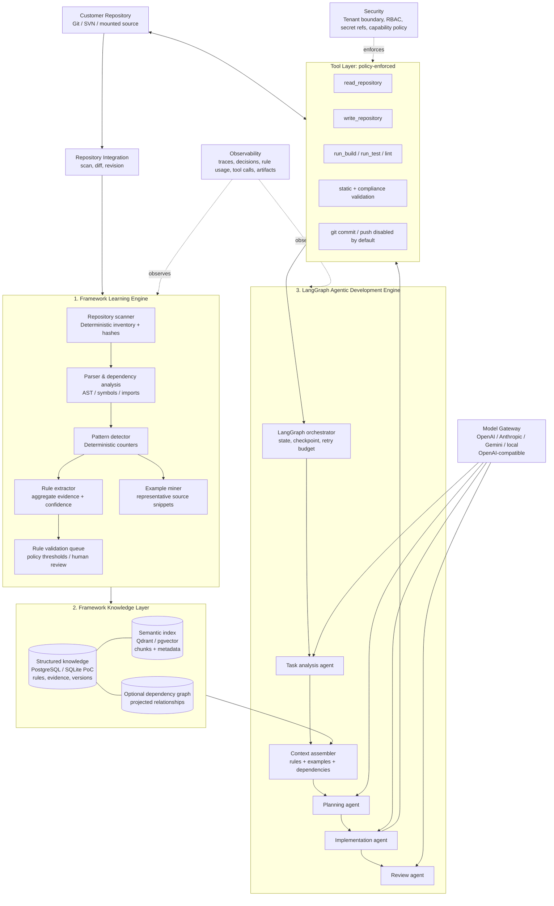
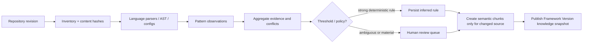
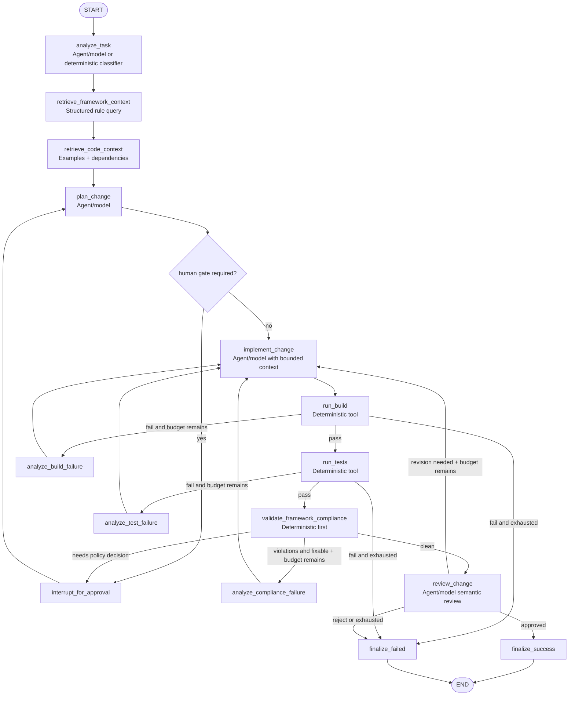
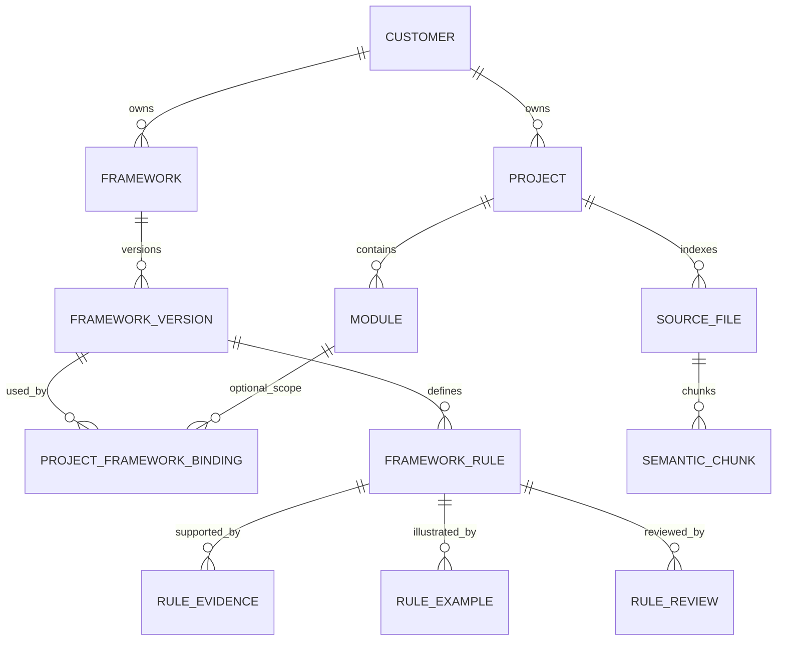

# Framework Intelligence + Agentic Development Platform — System Architecture

## 1. Problem, options, and selected approach

### Problem
A customer-specific framework is mostly implicit: it appears in repeated source structures, build configuration, dependencies, examples, tests, and documentation. A vector index alone can retrieve text but cannot represent explicit, versioned, auditable rules such as “services extend `AbstractService`”. Conversely, a rules-only system cannot supply the code examples and local context necessary to implement a task safely.

### Options considered

| Decision | Options | Selected approach | Rationale |
|---|---|---|---|
| Orchestration | Autonomous agent loop; deterministic pipeline; hybrid | **LangGraph hybrid workflow** | Reasoning benefits from agents, while builds/tests/security checks must be reproducible code. |
| Framework intelligence | RAG only; static rules only; dual knowledge | **Structured rules + semantic examples** | Explicit rules are queryable and enforceable; examples/documentation retain semantic richness. |
| Structured storage | Document DB; graph DB only; relational DB + JSON | **PostgreSQL + JSONB, with optional graph projection** | Strong tenancy, transactions, versioning, SQL reporting and simple on-prem operations. A graph is added only when cross-module dependency traversals justify it. |
| PoC persistence | PostgreSQL only; local embedded DB | **SQLite local-first adapter** | Real executable demo with no infrastructure dependency; repository interfaces make production PostgreSQL substitution explicit. |
| Pattern discovery | LLM-first; AST/heuristics first | **Deterministic extraction first, LLM adjudication only for ambiguity** | Reliable, low cost, explainable evidence; avoids promoting speculative rules. |
| Coding model | Provider SDK in core; provider-neutral port | **Model Gateway port + deterministic PoC model** | Providers/local endpoints plug in without leaking SDK dependencies into domain/workflow code. |

## 2. Core design principles

1. **LangGraph is orchestration, not framework intelligence.** It never becomes the source of truth for rules.
2. **Evidence precedes inference.** A rule stores examples, conflicts, confidence and provenance. Weak observations become candidates, not standards.
3. **Deterministic before agentic.** Repository I/O, parsing, indexing, compilation, tests, validation and permission checks are tools/services; models reason only over bounded artifacts.
4. **Task-aware bounded context.** The coding node gets a task intent, selected rules, analogous examples and dependency references—not the full repository.
5. **Version and isolate from day one.** All knowledge is scoped by customer, framework, framework version, project and optional module.
6. **No hidden destructive actions.** Tool capabilities are checked before invocation; commit/push and database write are denied by default.

## 3. Component architecture



## 4. Learning engine: initial and incremental operation

### Initial learning



One **Learning Pipeline** is enough: scanner, parser/dependency analyzer, pattern analyzer, rule aggregator and indexer are deterministic services within it, rather than independent LLM agents. An optional LLM is invoked only to label a difficult architectural relationship or summarize evidence for a reviewer.

### Incremental learning

1. Repository connector reads a Git commit range (or SVN revision range) and produces changed/deleted file identities.
2. The scanner recomputes hashes only for changed files; deleted files are tombstoned.
3. Parser/pattern observations for affected files are replaced, not appended.
4. Impact analysis follows reverse import/symbol/module edges to re-evaluate only affected aggregate rules.
5. Semantic chunks are upserted/deleted by `file_id + content_hash`.
6. Evidence aggregates, confidence and review status are recalculated; the prior knowledge snapshot remains immutable/auditable.

A full re-index is reserved for parser-version changes, a new framework-version boundary, or explicit administrator request.

## 5. Security, tenancy, and deployment

**Deployment:** on-prem Kubernetes is the production target. Each customer receives either a dedicated namespace/database/vector collection (strong isolation) or a shared deployment with mandatory `tenant_id` row-level security and per-tenant encryption keys. Source stays in customer-controlled Git/SVN or mounted workspace. Local model and embedding endpoints are supported through the Model Gateway; external egress is explicitly disabled in private mode.

**Tool permission model:** every run carries an immutable capability grant. `read_repository`, `write_repository`, `run_build`, `run_test`, `static_analysis`, `database_read`, `database_write`, `shell_command`, `git_commit`, and `git_push` are independently authorized. The PoC grants only read/write inside the configured repository plus test execution; arbitrary shell, commit, push and database writes are denied. Sandboxed worktrees/containers, allowlisted commands, redacted logs, secret references (never secret prompt injection), and resource/time quotas are mandatory production controls.

## 6. Observability and reproducibility

Each learning run and development run receives a correlation ID. Persist structured events for: graph/node lifecycle, state transitions, model identity/prompt hash/token use, retrieved rule and example IDs, tool invocation inputs (redacted) and output hashes, generated patches, validation findings, retries, durations and terminal outcome. OpenTelemetry traces + metrics are emitted; raw source is optional, encrypted and retention-governed. Replaying a run pins repository revision, framework-version snapshot, model configuration, selected knowledge IDs and tool policy.

## 7. Extension boundary

The core exposes application services and typed ports, not UI-specific workflows. CLI, REST API, IDE plugin, MCP server, Claude Code and Codex adapters call the same task submission/read-model interfaces. Provider SDKs and transport schemas belong in adapters, therefore none controls the domain model or LangGraph state.

---

# LangGraph Graph Design

## State model

`DevelopmentState` is a typed, append-only-friendly state contract:

| Field | Purpose |
|---|---|
| `run_id`, `tenant_id`, `project_id`, `framework_version_id` | Scope and reproducibility identity |
| `task` | User request |
| `task_kind`, `required_rule_kinds` | Bounded task analysis result |
| `framework_rules`, `examples`, `dependency_paths` | Retrieved, minimum implementation context |
| `plan`, `generated_files`, `change_summary` | Agentic artifacts |
| `build_result`, `test_result`, `validation_report` | Deterministic evidence |
| `retry_count`, `retry_budget`, `failure_reason` | Controlled feedback loop |
| `events` | Observable state transitions |
| `status` | `running`, `needs_human_review`, `succeeded`, `failed` |

## Nodes and responsibilities



### Edges, retry, persistence and humans

* Conditional edges gate every deterministic result and check `retry_count < retry_budget`; there is no unbounded loop.
* `analyze_build_failure`, `analyze_test_failure`, and `analyze_compliance_failure` turn machine output into a compact repair instruction, then return to implementation.
* A production compiled graph uses a checkpointer (`PostgresSaver`) keyed by `run_id`; a worker can resume after outage.
* `interrupt_for_approval` is used for low-confidence, conflicting, destructive, or policy-sensitive operations. Approved/rejected/edited framework rules retain human provenance.
* Reusable subgraphs: **learning** (scan → parse → discover → validate → index) and **repair** (analyze failure → implement → verify) preserve reuse without exploding agent count.

---

# Framework Knowledge Model

## Logical hierarchy

`Customer → Framework → FrameworkVersion → Project → Module` is explicit. A project binds to a framework version for a revision range; a module may override/extend that binding, never mutate its parent version.

## Relational schema (production)



### Essential entities

| Entity | Selected fields |
|---|---|
| `framework_rule` | `id`, scope IDs, `kind`, `subject`, `predicate`, `expected_value JSONB`, `severity`, `status`, `origin`, `confidence`, `support_count`, `conflict_count`, `min_evidence_required`, `discovered_at`, `supersedes_rule_id` |
| `rule_evidence` | `id`, `rule_id`, `source_file_id`, `revision`, `symbol`, `span_start/end`, `observation JSONB`, `polarity` (`support`/`conflict`), `parser_version`, `observed_at` |
| `rule_example` | `id`, `rule_id`, `source_file_id`, `symbol`, `snippet_hash`, `quality_score`, `is_representative` |
| `rule_review` | `id`, `rule_id`, `action` (`approve`/`reject`/`edit`), `actor`, `comment`, `replacement JSONB`, `reviewed_at` |
| `source_file` | scope IDs, path, language, content hash, repository revision, deleted flag |
| `semantic_chunk` | source file, chunk offsets/hash, embedding model/version, vector ID, metadata |

### Rule provenance and status

`origin ∈ {deterministic_inferred, llm_inferred, human_approved, human_edited, imported}` and `status ∈ {candidate, active, rejected, superseded, deprecated}`. An inference becomes `active` only if policy thresholds are met or a reviewer approves it. Rule confidence is recomputed from weighted support and conflicts; human approval is authoritative but does not erase the observed evidence.

### Executable PoC coding-context boundary

The PoC proves the rule-to-code boundary with a typed `CodingContext`, assembled outside the model layer:

```python
@dataclass(frozen=True)
class CodingContext:
    service_base_class: str
    service_decorator: str
    imports: tuple[ImportSpec, ...]
    logger_class: str
    logger_attribute: str
    logger_method: str
    examples: tuple[CodeExample, ...]
```

Generic Python AST discovery emits `service.base_class`, `service.required_decorator`, `logging.logger_class`, `logging.logger_attribute`, and `logging.required_method`. The first three include `metadata.import_module` learned from source imports. The deterministic PoC generator receives only this context; customer symbols do not occur anywhere in `src/agentic_platform`. A second repository with different symbols and a base-class rename mutation are integration-tested against the unchanged product source.

### Example rule payload

```yaml
id: rule-service-base-class-v2
scope:
  customer: acme
  framework: commerce-platform
  framework_version: "2.3"
  project: payments
  module: payment-api
kind: service.base_class
subject_selector:
  language: java
  symbol_kind: class
  name_suffix: Service
expected:
  extends: AbstractService
severity: error
origin: deterministic_inferred
status: active
confidence: 0.96
support_count: 148
conflict_count: 3
minimum_evidence: 10
evidence_refs: [evidence-101, evidence-102]
example_refs: [example-payment-service]
discovered_at: 2026-08-25T00:00:00Z
parser_version: java-ast-1
```

## Storage selection

* **PostgreSQL** is the authoritative structured store and LangGraph checkpoint store. JSONB supports language-specific observations while relational constraints enforce scope, versioning and provenance.
* **Qdrant** is the recommended standalone on-prem vector store. It provides metadata filtering by customer/version/project/module and operationally separates vector workloads. `pgvector` is a valid smaller-deployment alternative.
* **Graph projection is optional.** PostgreSQL recursive queries/modelled edges handle PoC dependencies. Introduce Neo4j only after query profiling proves multi-hop dependency impact analysis is a bottleneck.
* **YAML/JSON is import/export and human-review interchange**, not the authoritative multi-user store.

---

# Technology Selection

| Concern | Recommendation | Why / boundaries |
|---|---|---|
| Language & API | Python 3.11+, FastAPI adapter later | LangGraph ecosystem; typed domain/application boundaries. No API is required for this local PoC. |
| Orchestration | LangGraph `StateGraph` | Explicit state, conditional repair paths, interrupts and checkpointers. |
| LangGraph persistence | `langgraph-checkpoint-postgres` / `PostgresSaver`; SQLite checkpointer/local state in PoC | Production durability and HA; no Docker requirement in demo. |
| Structured DB | PostgreSQL 16 + SQLAlchemy/Alembic | Tenant/version integrity, JSONB evidence payloads, transactions and operational maturity. |
| Vector DB | Qdrant; pgvector for compact install | On-prem, filtered collections, independent scaling; vector data remains secondary. |
| Code parsing | Tree-sitter with language plugins; native AST adapters where richer (JavaParser/Semgrep) | Multi-language incremental parsing; deterministic symbol/pattern observations. PoC uses Python `ast` to be executable without a parser daemon. |
| Static analysis | Semgrep + language-native format/lint/build tools | Policy rules plus ecosystem correctness; executed through allowlisted tool adapter. |
| Repository integration | Dulwich/Git CLI adapter, SVNKit/`svn` adapter | Revision-aware diffing and credential isolation behind a port. |
| Embeddings | Configurable local `sentence-transformers` or OpenAI-compatible embedding endpoint | Meets air-gapped mode and model independence. |
| Model abstraction | Typed `ModelGateway` port, provider adapters (OpenAI, Anthropic, Gemini, LiteLLM/OpenAI-compatible/local) | Prevents provider SDK leakage into core. PoC has a real deterministic template model, not a fake no-op. |
| Observability | OpenTelemetry + structured JSON events; Grafana/Tempo/Loki/Prometheus deployment | Vendor-neutral auditability. LangSmith can be an optional, disabled-by-default cloud adapter. |
| Secrets | Kubernetes Secrets/Vault with references only | No credentials in prompts, logs or repositories. |

---

# Production-oriented Repository Structure

```text
.
├── ARCHITECTURE.md
├── README.md
├── pyproject.toml
├── src/
│   └── agentic_platform/
│       ├── domain/                 # Typed entities, rule/evidence contracts
│       ├── framework_learning/     # Scan, AST adapters, observations, aggregation
│       ├── framework_knowledge/    # Repository ports and SQLite/Postgres adapters
│       ├── retrieval/              # Task-aware rule/example/dependency assembly
│       ├── orchestration/          # LangGraph state, graph, checkpoint integration
│       ├── agents/                 # Task/planning/coding/review ports + adapters
│       ├── validation/             # Deterministic compliance/build/test validators
│       ├── tools/                  # Sandboxed, policy-enforced repository tools
│       ├── models/                 # Provider-neutral model gateway ports/adapters
│       ├── security/               # Capability grants and policy checks
│       ├── observability/          # Events/tracing adapters
│       └── cli.py                  # Local executable entry point
├── examples/
│   └── sample_customer_repo/       # Actual analyzed Python framework sample
└── tests/
    ├── unit/
    └── integration/
```

The PoC implements a narrow vertical slice: Python service conventions (`BaseService`, `@business_service`, `CompanyLogger`, no `print`) are **discovered from an example repository**, persisted with evidence, retrieved for `CustomerAccountService`, used by a deterministic coding model to write code, validated, and test-executed by a LangGraph graph. It establishes extensibility rather than claiming generic language support before its parsers exist.
